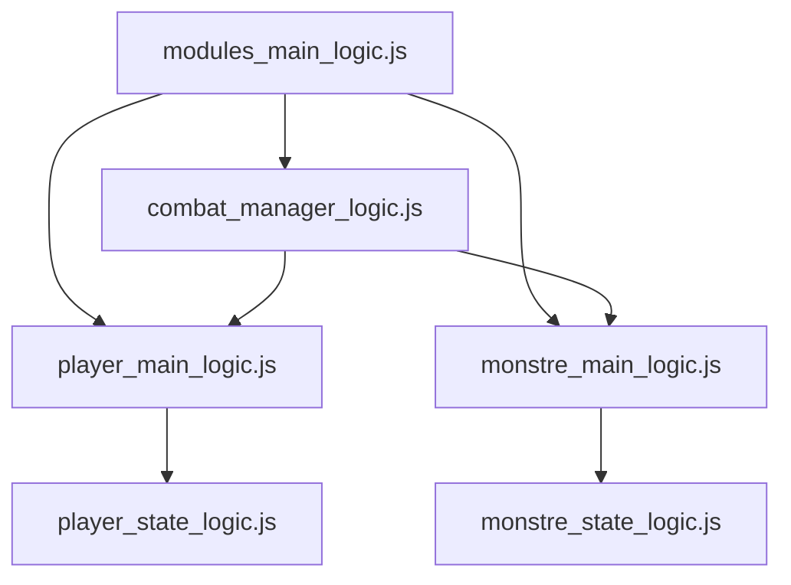
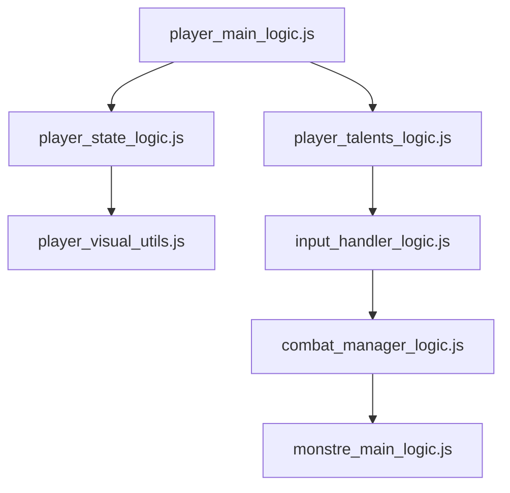

# Architecture du projet

## Structure des modules principaux



## Convention de nommage
- Toutes les fonctions en français
- snake_case pour les variables et fonctions
- PascalCase pour les classes (si existantes)
- Préfixes pour les types :
  - 'creer_' pour les constructeurs
  - 'get_' pour les accesseurs
  - 'appliquer_' pour les effets

## Organisation des Modules JavaScript (v2)

### Nouveau système d'imports

**Principes clés :**
- Utilisation exclusive d'imports ciblés (pas d'`import * as modules`)
- Dépendances clairement définies entre modules
- Réduction des dépendances circulaires

**Structure recommandée :
```javascript
// Bonne pratique - Import ciblé
export { fonction1, fonction2 } from './module_source.js';

// À éviter - Import global
import * as modules from './modules_main_logic.js';
```

### Modules Principaux

1. **Player Modules**
   - `player_main_logic.js` : Logique métier du joueur
   - `player_state_logic.js` : Gestion de l'état
   - `player_visual_utils.js` : Effets visuels
   - `player_talents_logic.js` : Gestion des talents

2. **Monster Modules**
   - `monstre_main_logic.js` : Logique principale
   - `monstre_state_logic.js` : État des monstres
   - `monstre_visual_utils.js` : Animations

3. **Core Modules**
   - `combat_manager_logic.js`
   - `map_main_logic.js`
   - `input_handler_logic.js`

### Flux de données



### Bonnes Pratiques
1. Toujours importer directement depuis le module source
2. Éviter les imports transitifs via `modules_main_logic.js`
3. Documenter les dépendances entre modules
4. Utiliser des alias pour éviter les conflits de noms

### Changements récents
- Élimination complète des imports globaux
- Réorganisation hiérarchique des dépendances
- Meilleure isolation des responsabilités

## Flux de données
1. Initialisation : main_entry_point.js
2. Boucle principale : map_main_logic.js
3. Interactions : input_handler_logic.js
4. État : player_state_logic.js et monstre_state_logic.js

## Gestion de la caméra

Flux principal :
1. La position du joueur est récupérée via `getPositionJoueur()`
2. La caméra calcule son décalage pour centrer le joueur
3. Les limites de la map sont vérifiées
4. Le décalage est appliqué au conteneur du jeu

## Gestion des inputs

Touches principales :
- ZQSD : Déplacement
- Espace : Interaction/Attaque
- E : Inventaire
- F : Compétence spéciale

Flux :
1. Écouteur d'événements → input_handler_logic.js
2. Délégation aux systèmes concernés (déplacement, combat, etc.)

## Système de cartes

Structure :
- Format JSON pour la définition des cartes
- Tuiles 64x64 pixels
- Gestion des collisions par couches

Flux :
1. Chargement asynchrone → map_main_logic.js
2. Parsing et création du DOM
3. Gestion des transitions entre cartes

## Bonnes pratiques

- Utiliser des imports ciblés
- Éviter les dépendances circulaires
- Tester chaque module indépendamment
- Documenter les changements
