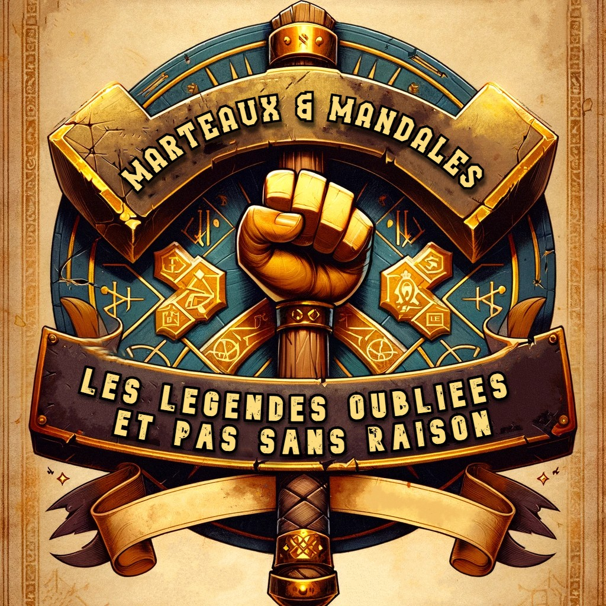

# Marteau-Mandale
_"Les Légendes Oubliées (et pas sans raison)" – Parce que certains héros auraient mieux fait de rester anonymes._



## Description

Bienvenue dans **Marteaux & Mandales**, un dungeon crawler humoristique basé sur Flask et jouable dans le navigateur.

## Fonctionnalités

- 🗺️ **Exploration de Donjons** : Parcourez des niveaux remplis de pièges et de trésors
- ⚔️ **Combats Simples** : Affrontez des ennemis dans un style RPG
- 😂 **Personnages Hauts en Couleur** : Héros aux capacités uniques et dialogues absurdes
- 🔒 **Système de Compte Sécurisé** :
  - Hachage sécurisé BLAKE2b + PBKDF2 pour les identifiants
  - Fichiers utilisateurs individuels cryptographiquement sécurisés
  - Protection contre les attaques par énumération
- 🌟 **Effets Visuels** : Particules animées avec tsparticles

## Technologies Utilisées

- **Flask** : Backend Python léger
- **HTML, CSS, JS** : Pour l'interface utilisateur
- **tsparticles** : Effet d'étincelles
- **Cryptographie** :
  - BLAKE2b pour le hachage des noms de fichiers
  - PBKDF2-HMAC-SHA256 pour les mots de passe (100 000 itérations)
- **Jinja2** : Moteur de templates Flask
- **pathlib** : Gestion sécurisée des chemins

## Comment Jouer

1. Lancez le serveur Flask (`python app.py` ou `flask run`)
2. Ouvrez le navigateur sur `http://localhost:5000`
3. Créez un compte (les anciens comptes ont été réinitialisés)
4. Lancez une nouvelle partie

## Arborescence du Projet

```
📁 Marteau-Mandale/
│
├── 📄 app.py                   # Script principal pour lancer Flask
├── 📄 requirements.txt         # Dépendances Python
│
├── 📁 app                      # Dossier contenant les modules Flask
│   ├── 📄 __init__.py          # Initialisation du module Flask
│   ├── 📄 routes.py            # Routes HTTP du jeu
│   ├── 📄 player_manager.py    # Gestion sécurisée des joueurs
│   ├── 📄 utils.py             # Fonctions utilitaires générales
│   │
│   ├── 📁 save_data            # Dossier des sauvegardes sécurisées
│   │   └── 📄 .gitkeep         # Fichier pour conserver le dossier dans Git
│   │
│   ├── 📁 templates            # Templates HTML pour les pages
│   │   ├── 📄 index.html       # Page d'accueil (connexion, inscription)
│   │   ├── 📄 menu.html        # Page du menu principal
│   │   └── 📄 jeu.html         # Interface du jeu
│   │
│   └── 📁 static               # Fichiers statiques (CSS, JS, Images)
│       │
│       ├── 📁 css
│       │   └── 📄 style.css    # Style principal de l'application
│       │
│       ├── 📁 js
│       │   └── 📄 particles-config.js  # Scripts JS complémentaires
│       │
│       ├── 📁 img              # Images générales du jeu
│       │   ├── 📁 classes
│       │   │   ├── 📄 paladin.png
│       │   │   ├── 📄 mage.png
│       │   │   ├── 📄 voleur.png
│       │   │   └── 📄 barbare.png
│       │   ├── 📄 background.jpg
│       │   ├── 📄 logo.jpg
│       │   └── 📄 favicon.ico
│       │
│       ├── 📁 maps             # Cartes générées avec Tiled
│       │   ├── 📄 map1.json
│       │   ├── 📄 Sprite-coline-0003.tsx
│       │   └── 📄 Sprite-coline-0003.png
│       │
│       └── 📁 talents          # ⚠️ NOUVEAU dossier pour les talents des classes
│           ├── 📄 paladin_talents.json   # Talents du Paladin
│           ├── 📄 mage_talents.json      # Talents du Mage
│           ├── 📄 voleur_talents.json    # Talents du Voleur
│           └── 📄 barbare_talents.json   # Talents du Barbare
│
├── 📁 save_data                # Stockage des données sauvegardées
│   └── 📄 partie1.json         # Exemple de fichier de sauvegarde d'une partie
│
├── 📄 README.md                # Description et documentation du projet
└── 📄 LICENSE                  # Licence du projet

## Sécurité

Ce projet implémente plusieurs bonnes pratiques de sécurité :
- Aucun stockage en clair des identifiants
- Sels cryptographiques uniques par utilisateur
- Hachage sécurisé des noms de fichiers
- Validation stricte des entrées utilisateur

## Contribution

- Forkez le projet
- Créez une branche (`git checkout -b feature/ma-feature`)
- Committez (`git commit -m 'Ajout de ...'`)
- Poussez (`git push origin feature/ma-feature`)
- Ouvrez une Pull Request

## Licence

Ce projet est sous licence MIT. Voir le fichier [LICENSE](LICENSE).

---

🎲 Amusez-vous bien dans **Marteaux & Mandales** ! Et rappelez-vous : même les héros ont le droit de se tromper (souvent).
